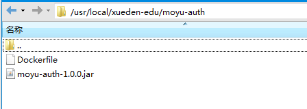
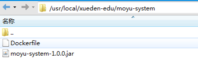

# 第1章 自定义网络

## 1.1 创建自定义网络

创建自定义网络命令：docker network create

```shell
docker network create --driver bridge xueden
```

> 解析
>
>  --driver bridge 表示使用桥接模式 
>
>  xueden 表示网络名 

## 1.2 查看所有的docker网络

如下命令：

```shell
docker network ls
```


## 1.3 查看自己定义的网络相关信息

如下命令：

```shell
docker network inspect xueden
```


# 第2章 安装mysql5.7

## 2.1 拉取mysql镜像

```shell
docker pull mysql:5.7
```


## 2.2 运行mysql容器

```shell
docker run -p 3306:3306 --name mysql \
-v /data/mysql/log:/var/log/mysql \
-v /data/mysql/data:/var/lib/mysql \
-v /data/mysql/conf:/etc/mysql \
-e MYSQL_ROOT_PASSWORD=root \
--net xueden \
--restart always \
-d mysql:5.7
```

>注意，如果有端口被占用，如下操作
>
>查看端口号： netstat -tanlp 
>
> 杀死进程(注意不是杀死端口，而是pid的端口) ： kill 1785进程 (自己的pid端口) 
>
>

## 2.3 配置mysql

先创建  my.cnf 文件，输入命令：

```shell
cd /data/mysql/conf
```

```shell
vi my.cnf
```

复制以下内容：

```shell
[client]
default-character-set=utf8
[mysql]
default-character-set=utf8
[mysqld]
init_connect='SET collation_connection = utf8_unicode_ci'
init_connect='SET NAMES utf8'
character-set-server=utf8
collation-server=utf8_unicode_ci
skip-character-set-client-handshake
skip-name-resolve
```


保存退出，重启mysql容器即可：

```shell
docker restart mysql
```


# 第3章 安装nacos

## 3.1 拉取nacos镜像

```shell
docker pull nacos/nacos-server
```

## 3.2 运行nacos容器

```shell
docker run  -d \
--network xueden \
-e MODE=standalone \
-e SPRING_DATASOURCE_PLATFORM=mysql \
-e MYSQL_SERVICE_HOST=192.168.56.12 \
-e MYSQL_SERVICE_PORT=3306 \
-e MYSQL_SERVICE_USER=root \
-e MYSQL_SERVICE_PASSWORD=root \
-e MYSQL_SERVICE_DB_NAME=nacos_xueden \
-p 8848:8848 \
--name nacos \
--restart=always \
nacos/nacos-server
```


# 第4章 安装redis

## 4.1 拉取redis镜像

```shell
docker pull redis
```


## 4.2 运行redis容器

```shell
docker run -p 6379:6379 --name redis -v /data/redis/data:/data \
-v /data/redis/conf/redis.conf:/etc/redis/redis.conf \
-d redis redis-server /etc/redis/redis.conf 
```


# 第5章 安装 sentinel-dashboard 


 Sentinel 控制台是流量控制、熔断降级规则统一配置和管理的入口，它为用户提供了机器自发现、簇点链路自发现、监控、规则配置等功能。在 Sentinel 控制台上，我们可以配置规则并实时查看流量控制效果。 

## 5.1 sentinel-dashboard 

使用如下命令拉取镜像

```shell
docker pull bladex/sentinel-dashboard
```


## 5.2 启动sentinel-dashboard 


```shell
docker run --name sentinel --network xueden  -d -p 8858:8858 -d  bladex/sentinel-dashboard
```

默认账号和密码都是：sentinel

sentinel官方文档：

 [https://github.com/alibaba/Sentinel/wiki/%E4%B8%BB%E9%A1%B5](https://github.com/alibaba/Sentinel/wiki/主页) 


# 第6章 安装网关微服务moyu-gateway

## 6.1 上传Dockerfile和moyu-gateway-1.0.0.jar文件到服务器

把文件上传到指定目录即可


## 6.2 修改docker-compose.yml文件

添加如下配置：

```yaml
 gateway:
    build:
      context: moyu-gateway # 指定上下文目录dockerfile所在目录
      dockerfile: Dockerfile
    container_name: gateway
    ports:
      - "7000:7000"
    networks:
      - xueden
    depends_on:
      - nacos
```


## 6.3 启动网关微服务

如下所示：

```shell
docker-compose up gateway
```


# 第7章 安装认证中心微服务moyu-auth

## 7.1 上传Dockerfile和moyu-auth-1.0.0.jar文件到服务器

上传到指定位置即可




## 7.2 修改docker-compose.yml文件

添加如下配置：

```yaml
auth:
    build:
      context: moyu-auth # 指定上下文目录dockerfile所在目录
      dockerfile: Dockerfile
    container_name: auth
    ports:
      - "8000:8000"
    networks:
      - xueden
    depends_on:
      - nacos
      - mysql
      - redis
```


## 7.3 启动认证中心微服务

如下所示：

```shell
docker-compose up auth
```


# 第8章 安装系统管理微服务moyu-system

## 8.1 上传Dockerfile和moyu-auth-1.0.0.jar文件到服务器




## 8.2 修改docker-compose.yml文件

```yaml
system:
    build:
      context: moyu-system # 指定上下文目录dockerfile所在目录
      dockerfile: Dockerfile
    container_name: system
    ports:
      - "9000:9000"
    networks:
      - xueden
    depends_on:
      - nacos
      - mysql
      - redis
```


## 8.3 修改  moyu-system-dev.yml  配置文件


# 第9章 安装教育微服务moyu-edu 

## 9.1 上传Dockerfile和moyu-edu-1.0.0.jar文件到服务器

把文件上传到指定目录即可

## 9.2 修改docker-compose.yml文件

添加如下配置信息

```yaml
edu:
    build:
      context: moyu-edu # 指定上下文目录dockerfile所在目录
      dockerfile: Dockerfile
    container_name: edu
    ports:
      - "6000:6000"
    networks:
      - xueden
    depends_on:
      - nacos
      - mysql
      - redis
    volumes:
      - /var/xueden:/var/xueden:ro
```


## 9.3 添加微信支付宝相关文件


* 在服务器上新建一个alipay目录存放支付宝文件，如下图所示：
  * xueden_alipayCertPublicKey_RSA2.crt
  * xueden_alipayRootCert.crt
  * xueden_appCertPublicKey_2021002145693592.crt
  * xueden_merchantPrivateKey.txt


* 在服务器上新建一个wxpay目录存放支付宝文件，如下图所示：
  * apiclient_cert.pem
  * apiclient_key.pem
  * wechatpay_1AE730C43AEF378DF327266692F3BB9567C42A00.pem


## 9.4 修改 moyu-edu-dev.yml 配置文件

登录nacos后台修改 moyu-edu-dev.yml 文件

* 修改支付宝支付配置信息，如下所示：

```yaml
# 支付支付配置信息
alipay:
  # 请求协议
  protocol: https
  # 请求网关
  gatewayHost: openapi.alipay.com
  # 签名类型
  signType: RSA2
  # appid需要修改成自己的
  appId: xxxxxxxxxxxxx 
  # 私钥 需要修改成自己的
  merchantPrivateKey: usr/local/xueden-edu/alipay/xueden_merchantPrivateKey.txt 
  # 应用公钥证书文件路径 需要修改成自己的
  merchantCertPath: usr/local/xueden-edu/alipay/xueden_appCertPublicKey_2021002145693592.crt
  # 支付宝公钥证书文件路径 需要修改成自己的
  alipayCertPath: usr/local/xueden-edu/alipay/xueden_alipayCertPublicKey_RSA2.crt
  # 支付宝根证书文件路径 需要修改成自己的
  alipayRootCertPath: usr/local/xueden-edu/alipay/xueden_alipayRootCert.crt
  # 购买课程异步回调通知 需要修改成自己的
  notifyCourseUrl: http://wxtest.xueden.cn/edu/pay/aliCourseCallback
  # 购买VIP异步回调通知 需要修改成自己的
  notifyVipUrl: http://wxtest.xueden.cn/edu/pay/aliVipCallback   
```

* 修改微信支付配置信息，如下所示：

  ```yaml
  # 微信支付配置信息
  wechatpay:
    #  商户号 需要修改成自己的
    mchId: xxxxxxxxxx
    #  微信公众平台服务号appId 需要修改成自己的
    appId: xxxxxxxxxxxxx
    #  v3接口 CA证书 apiclient_key.pem私钥内容 需要修改成自己的
    privateKey: /usr/local/xueden-edu/wxpay/apiclient_key.pem
    #  wechatpay.pem证书内容 需要修改成自己的
    wechatpaykey: /usr/local/xueden-edu/wxpay/wechatpay_1AE730C43AEF378DF327266692F3BB9567C42A00.pem
    #  商户证书序列号 CA证书 可查看微信商户平台-账户设置-安全设置-api安全密钥 需要修改成自己的
    mcHserialNo: xxxxxxxxxxxxxxxxxx
    # native支付请求接口
    nativeV3Api: https://api.mch.weixin.qq.com/v3/pay/transactions/native
    # 购买课程异步回调通知 需要修改成自己的
    notifyCourseUrl: http://wxtest.xueden.cn/edu/pay/wxCourseCallback
    # 购买VIP会员异步回调通知 需要修改成自己的
    notifyVipUrl: http://wxtest.xueden.cn/edu/pay/wxVipCallback
    # apiv3密钥 需要修改成自己的
    aPIv3key: xxxxxxxxxxxxxxxxxxxxxxxxxxxxxxx
  ```


> 以上支付证书文件必须正确，否则启动会失败


* 修改阿里云视频点播、短信以及oss配置信息  如下所示：

  ```yaml
  aliyun: #阿里云 vod
    vod: #不同的服务器，地址不同
      file:
        # 修改成自己的
        keyid: xxxxxxxxxxxxxxxxxx 
        # 修改成自己的
        keysecret: xxxxxxxxxxxxxxxxxxxxxxxx
        # 修改成自己的
        templategroupid: xxxxxxxxxxxxxxxxxx 
    oss: #阿里云 oss
      file:
        # 修改成自己的
        endpoint: oss-cn-shanghai.aliyuncs.com
        # 修改成自己的
        bucketname: xueden-cloud-edu
        # 修改成自己的
        bucketcoursename: xueden-cloud-edu-course
        host: career
        # 修改成自己的
        hostcourse: course
        # 修改成自己的
        hostpath: http://xxxxxxx.xxxxxxx.xxx
    sms: #阿里云 sms
      # 修改成自己的
      regionid: cn-hangzhou
      # 修改成自己的
      signname: 墨鱼课堂
      # 修改成自己的
      templatecode: xxxxxxxx
  ```

  

## 9.4 启动教育微服务

```shell
docker-compose up  edu
或者
docker-compose up -d edu
```


# 

